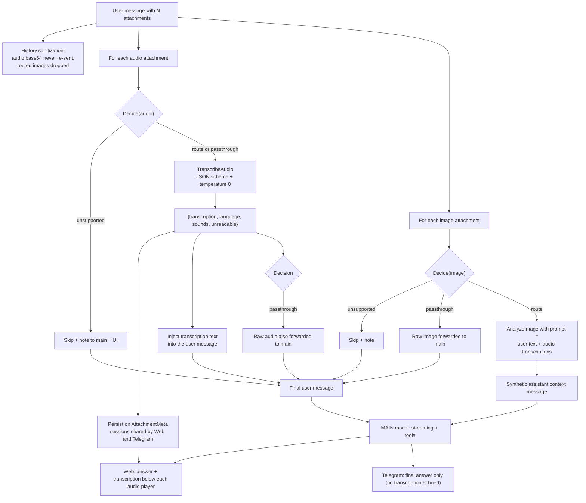

# Media Routing (audio / image)

Single source of truth for how attachments flow from a channel (Web or Telegram) to the main model. The implementation lives in `internal/router` (`router.go` + `media.go`) and is shared by both channels.

## Roles

| Role | Config key | Purpose |
|---|---|---|
| `main` | `OLLAMA_DEFAULT_MODEL` (or the model picked in the Web UI) | Thinking, tools, final answer |
| `audio` | `OLLAMA_MODEL_AUDIO` | Transcribes audio attachments |
| `vision` | `OLLAMA_MODEL_VISION` | Describes image attachments |

## Routing decision (`Router.Decide`)

For each attachment kind the router decides one of three actions, using the probed capabilities snapshot (`docs/probe-cache.json`, loaded via `cache.Checker`):

| # | Condition | Decision |
|---|---|---|
| 1 | Dedicated role model configured and different from main | `route` (pre-process with the dedicated model) |
| 2 | No capability snapshot available | `passthrough` (trust the configuration) |
| 3 | Main has the capability (`comprobado` or `inferido`) | `passthrough` (raw media goes to main) |
| 4 | Dedicated model explicitly set to main | `passthrough` (user forced it) |
| 5 | Otherwise | `unsupported` (attachment dropped gracefully, note injected) |

Key rule: **the transcription is ALWAYS extracted for audio**, even in passthrough mode. The audio model (dedicated or main) is called with structured output first; the transcription is used for display/persistence AND injected as text into the user message in both modes. In passthrough mode the raw audio is also forwarded, so the main model can analyze tone and sounds. The text injection keeps behavior deterministic: during testing, models with native audio (gemma4) sometimes failed to attend the audio attachment when tools/system prompts were present.

## Full flow



## Structured transcription output

`Router.TranscribeAudio` calls `POST /api/chat` with `format` set to a JSON schema and `temperature: 0` so the result is replicable:

```json
{
  "transcription": "verbatim speech, original language",
  "language": "es",
  "sounds": "background music",
  "unreadable": false
}
```

- The user prompt is intentionally NOT mixed into the transcription request: the transcription depends only on the audio; interpretation is the main model's job.
- On invalid JSON the call is retried once; as a last resort the raw text is used as the transcription.
- `unreadable: true` replaces the old `---UNREADABLE---` sentinel.

## Combination matrix

`A` = audio capability, `V` = vision capability.

| Main | Audio role | Vision role | Audio handling | Image handling |
|---|---|---|---|---|
| `gemma4:e4b` (A+V) | — | — | passthrough: raw audio + transcription text (extracted with main) | passthrough |
| `granite4.1:8b` (text+tools) | `gemma4:e4b` | — | route: transcribed by gemma, text injected to granite | unsupported → dropped with note |
| `freehuntx/qwen3-coder:8b` | `gemma4:e4b` | `qwen3.5:4b` | route: transcribed by gemma | route: described by qwen3.5 (prompt enriched with the transcriptions) |
| `qwen3.5:4b` (V) | `gemma4:e4b` | — | route: transcribed by gemma | passthrough |
| `granite4.1:8b` | — | — | unsupported → dropped with note, no error | unsupported → dropped with note |

### Prompt/audio combinations (any of the above)

| User input | Behavior |
|---|---|
| Audio only (audio IS the prompt) | Transcription becomes the user message text; in `passthrough` the raw audio is also attached; UI always shows the transcription |
| Text + audio ("study this audio...") | Text kept as the instruction; transcription appended as a labeled block |
| Multiple audios | Each transcribed independently; blocks labeled `audio attachment i of N`; UI maps each transcription by attachment index |
| Audio + image | Audio processed first; routed image analysis prompt includes user text + transcriptions |

## Channel behavior

- **Web**: receives a structured SSE event `media_pre_processing` with `{summary, attachments: [{index, kind, action, model, transcription, language, unreadable, note, description}]}`. Transcriptions are rendered below each audio player and persisted in the session attachment metadata (`transcription`, `unreadable`).
- **Telegram**: same pipeline (shared `router.ResolveMessages`); the transcription is persisted on the session attachment so the Web UI shows it, but it is NOT echoed back to the Telegram user — only the final answer is sent.
- **History**: audio base64 is never re-sent to the model on follow-up turns (its transcription text replaces it); images are dropped from history when image routing is active because their description already lives in the history as an assistant message.

## SSE event format

```
event: media_pre_processing
data: {
  "summary": "Media pre-processing context (produced by a vision model, ...)",
  "attachments": [
    {"index": 0, "kind": "audio", "action": "transcribed", "model": "gemma4:e4b",
     "transcription": "...", "language": "es", "unreadable": false},
    {"index": 1, "kind": "image", "action": "described", "model": "qwen3.5:4b",
     "description": "..."}
  ]
}
```

`action` is one of `transcribed`, `described`, `passthrough`, `skipped`.
